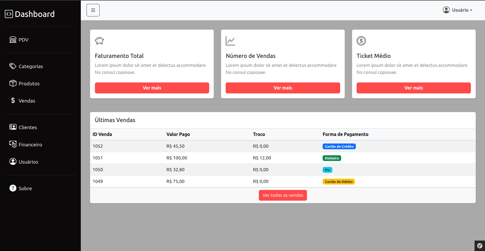
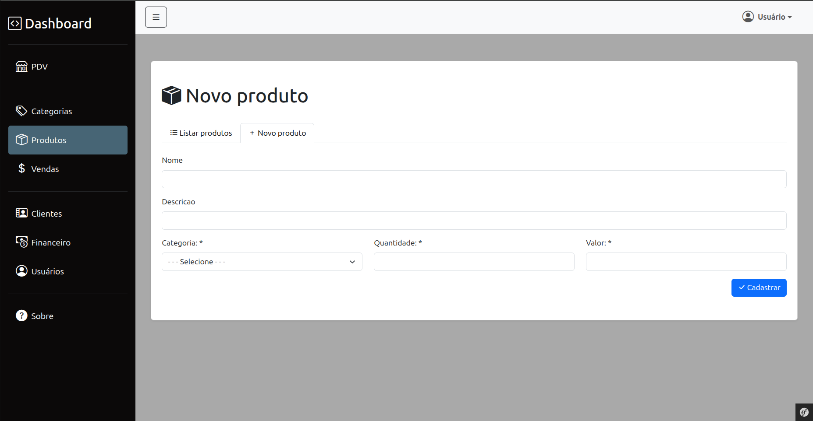

# 🛒 Projeto de PDV - MS Code

Um sistema de Ponto de Venda (PDV) e controle de estoque simples, feito com intuito acadêmico para pequenos negócios.

  
  
  
  

## 📝 Índice

* [Sobre o Projeto](#-sobre-o-projeto)
* [Visão Geral (Screenshots)](#-visão-geral)
* [Tecnologias Utilizadas](#-tecnologias-utilizadas)

---

## 💻 Sobre o Projeto

Este projeto é um PDV desenvolvido com o objetivo de facilitar o controle de vendas de uma pequena loja, aplicar conhecimentos em Desenvolvimento Web. Ele permite que o usuário realize vendas, controle o estoque de produtos e visualize um histórico de transações.

---

## 📸 Visão Geral

Aqui estão algumas das telas principais do sistema.

| Tela de Venda (PDV) | Dashboard | Cadastro de Produtos |
| :---: | :---: | :---: |
|  |  |  |

---

## 🚀 Tecnologias Utilizadas

O projeto foi construído utilizando as seguintes tecnologias:

* **Backend:** PHP (v8.4)
* **Framework:** Symfony (v7.4)
* **Banco de Dados:** MySQL
* **Frontend:** Bootstrap (v5.x), JavaScript, Twig
* **Gerenciador de Dependências:** Composer
* **Ferramentas de Dev:** Git, VS Code

---

